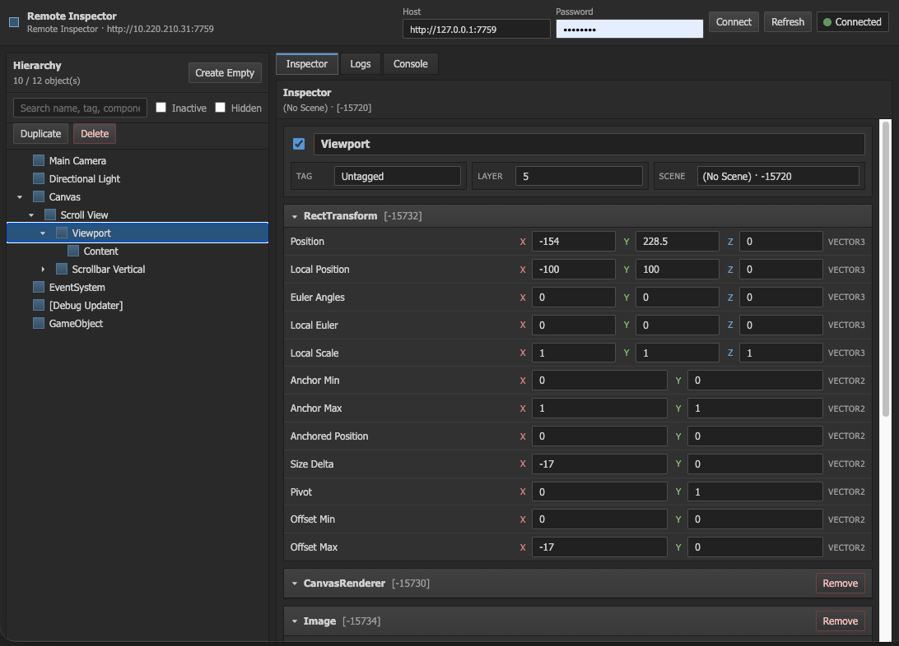
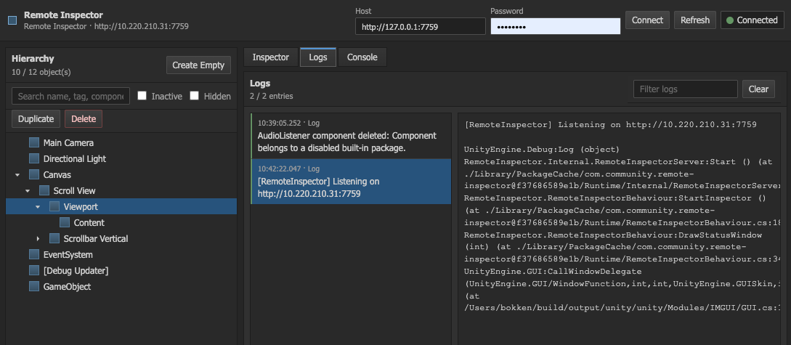
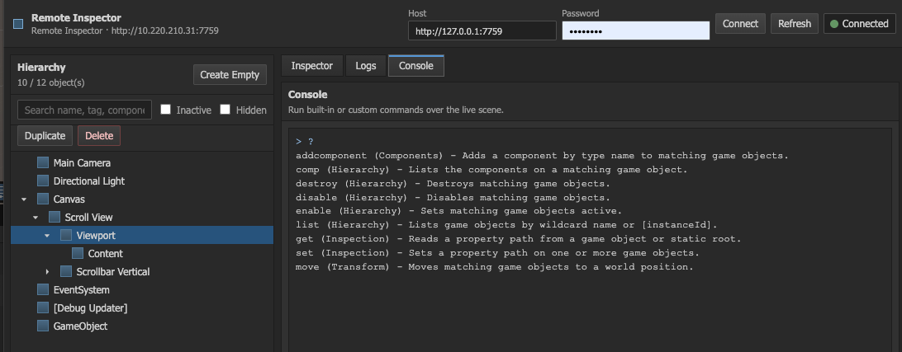
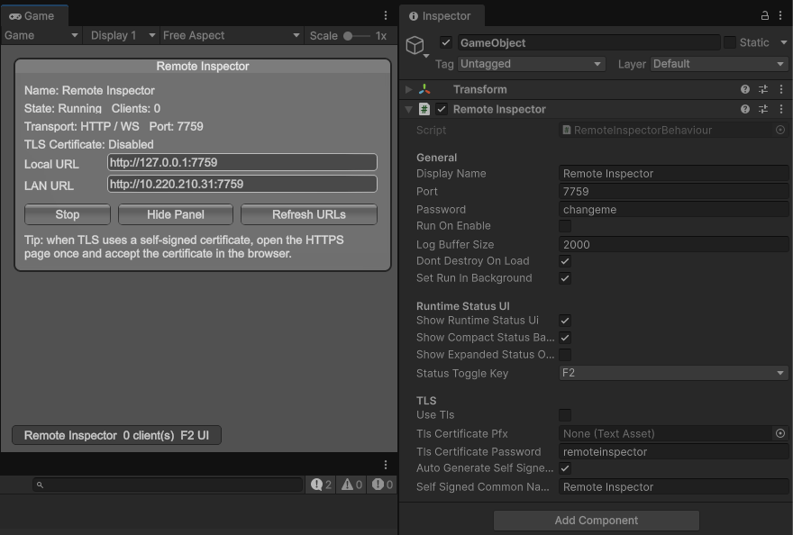

<p align="center">
  <h1 align="center">🔍 Remote Inspector</h1>
  <p align="center">
    <strong>WebSocket 기반 Unity 런타임 인스펙터 · 로그 뷰어 · 리모트 콘솔</strong>
  </p>
  <p align="center">
    <a href="#features">Features</a> •
    <a href="#screenshots">Screenshots</a> •
    <a href="#installation">Installation</a> •
    <a href="#quick-start">Quick Start</a> •
    <a href="#custom-commands">Custom Commands</a> •
    <a href="#tls--https">TLS / HTTPS</a> •
    <a href="#license">License</a>
  </p>
  <p align="center">
    
    
    
    
  </p>
</p>

---

## Overview

**Remote Inspector**는 실행 중인 Unity 애플리케이션의 Hierarchy, Component, Field를 **브라우저에서 실시간으로 조회·편집**할 수 있는 경량 런타임 인스펙터입니다.  
별도의 에디터 확장 없이 TCP/WebSocket 서버가 빌드에 포함되어 **Standalone 빌드에서도** 동작합니다.

---

## Features

| 기능 | 설명 |
|------|------|
| **🌲 Hierarchy Browser** | 씬 전체 GameObject 트리를 실시간으로 탐색 (검색·비활성 오브젝트 포함) |
| **🔎 Component Inspector** | 선택한 GameObject의 모든 컴포넌트·필드를 브라우저에서 확인 |
| **✏️ Live Editing** | `Vector3`, `Color`, `Rect`, `Bounds`, 컬렉션 요소 등 중첩 필드까지 브라우저에서 직접 수정 |
| **📋 Log Viewer** | `Debug.Log` / Warning / Error 스트림을 실시간으로 확인 (Stack Trace 포함) |
| **💻 Remote Console** | 커스텀 명령어를 등록하고 브라우저 콘솔에서 실행 |
| **🎨 Runtime Status UI** | 인게임 상태 오버레이 (접속 URL, 연결 수, TLS 정보) |
| **🔒 TLS / HTTPS** | PFX 인증서 또는 자동 생성된 Self-Signed 인증서로 HTTPS/WSS 전송 지원 |
| **🌐 Embedded Web UI** | 런타임에 내장된 HTML/CSS/JS를 직접 서빙 — 외부 호스팅 불필요 |

---

## Screenshots

> **📸 아래 이미지는 `Screenshots/` 폴더에 파일을 추가한 뒤 표시됩니다.**

| 화면 | 미리보기 |
|------|----------|
| Hierarchy & Inspector |  |
| Log Viewer |  |
| Remote Console |  |
| Runtime Status UI |  |

<!--
  스크린샷 추가 방법:
  1. Screenshots/ 폴더에 아래 파일명으로 이미지를 넣어주세요.
     - hierarchy_inspector.png
     - log_viewer.png
     - remote_console.png
     - runtime_status_ui.png
  2. 필요에 따라 행을 추가/제거하세요.
-->

---

## Installation

### Unity Package Manager (로컬 패키지)

1. 이 저장소를 클론하거나 `Packages/com.community.remote-inspector` 폴더를 프로젝트의 `Packages/` 디렉터리에 복사합니다.
2. Unity 에디터가 자동으로 패키지를 인식합니다.

### Git URL (UPM)

`Window → Package Manager → + → Add package from git URL…`에 아래 URL을 입력합니다:

```
https://github.com/shinepcsg/RemoteInspector.git?path=Packages/com.community.remote-inspector
```

---

## Quick Start

```
1. 빈 GameObject를 생성합니다.
2. "Remote Inspector" 컴포넌트를 추가합니다.  (Add Component → Remote Inspector)
3. Inspector에서 Port와 Password를 설정합니다.
4. Play Mode 진입 후 브라우저에서 http://127.0.0.1:<port> 에 접속합니다.
```

### Inspector 설정 항목

| 항목 | 기본값 | 설명 |
|------|--------|------|
| `Display Name` | Remote Inspector | 상태 UI에 표시되는 이름 |
| `Port` | 7759 | 서버 포트 (1024–65535) |
| `Password` | changeme | 브라우저 접속 시 인증 비밀번호 |
| `Run On Enable` | ✅ | 컴포넌트 활성화 시 자동으로 서버 시작 |
| `Log Buffer Size` | 2000 | 브라우저에 전달할 최대 로그 개수 |
| `Don't Destroy On Load` | ✅ | 씬 전환 시 유지 |
| `Set Run In Background` | ✅ | 백그라운드에서도 서버 유지 |
| `Show Runtime Status UI` | ✅ | 인게임 IMGUI 상태 패널 표시 |
| `Status Toggle Key` | F2 | 상태 패널 토글 키 |

---

## Custom Commands

`RemoteCommandAttribute`를 사용하여 브라우저 콘솔에서 실행할 수 있는 커스텀 명령어를 등록합니다.

```csharp
using RemoteInspector;
using UnityEngine;

public static class DemoCommands
{
    [RemoteCommand("Demo", "tp", "게임 오브젝트를 이름으로 찾아 텔레포트합니다.")]
    public static string Teleport(string name, Vector3 position)
    {
        var go = GameObject.Find(name);
        if (go == null)
            throw new System.Exception("GameObject not found.");

        go.transform.position = position;
        return $"Moved {go.name} to {position}.";
    }
}
```

**부트스트랩에서 등록:**

```csharp
public sealed class DemoBootstrap : MonoBehaviour
{
    private void Awake()
    {
        RemoteInspectorBehaviour.RegisterCommands<DemoCommands>();
    }
}
```

---

## TLS / HTTPS

Remote Inspector는 선택적으로 HTTPS/WSS 전송을 지원합니다.

| 모드 | 설정 |
|------|------|
| **PFX 인증서** | `Use TLS` ✅ → `TLS Certificate PFX`에 `.pfx` 파일 할당 |
| **자동 Self-Signed** | `Use TLS` ✅ + `Auto Generate Self Signed Certificate` ✅ |
| **비활성화** | `Use TLS` ❌ (기본값) |

> ⚠️ Self-Signed 인증서를 사용할 경우, 브라우저에서 HTTPS 페이지를 한 번 열어 인증서를 수동으로 신뢰해야 합니다.

---

## Architecture

```
┌─────────────────────────────────────────────────────┐
│  Browser (HTML / CSS / JS)                          │
│  ─ Hierarchy Panel ─ Inspector Panel ─ Log Panel ─  │
│  ─ Console Panel                                    │
└──────────────────────┬──────────────────────────────┘
                       │  WebSocket (ws:// or wss://)
                       ▼
┌──────────────────────────────────────────────────────┐
│  RemoteInspectorServer  (TCP → HTTP upgrade → WS)   │
│  ├─ RemoteInspectorIntrospection  (Hierarchy/Fields) │
│  ├─ RemoteInspectorLogService     (Log Buffer)       │
│  ├─ RemoteInspectorConsole        (Custom Commands)  │
│  └─ RemoteInspectorWebAssets      (Embedded HTML)    │
└──────────────────────────────────────────────────────┘
```

---

## Requirements

- **Unity 6000.0** 이상
- **Standalone** 또는 **Editor** 플랫폼
- 최신 브라우저 (Chrome, Edge, Firefox, Safari)

---

## Troubleshooting

| 문제 | 해결 |
|------|------|
| 브라우저에서 접속이 안됨 | 방화벽에서 해당 포트가 열려 있는지 확인하세요. |
| LAN 접속 불가 | 모바일 디바이스와 같은 네트워크에 연결되어 있는지 확인하세요. |
| HTTPS 인증서 오류 | Self-Signed 인증서를 사용하는 경우, 브라우저 경고를 수락하세요. |
| 필드가 편집 불가로 표시됨 | 해당 필드 타입이 아직 지원되지 않을 수 있습니다. |

---

## Project Structure

```
RemoteInspector/
├── Packages/
│   └── com.community.remote-inspector/
│       ├── package.json
│       ├── README.md
│       └── Runtime/
│           ├── RemoteInspectorBehaviour.cs      # 메인 MonoBehaviour
│           ├── Attributes/
│           │   └── RemoteCommandAttribute.cs    # 커스텀 명령어 어트리뷰트
│           ├── Internal/
│           │   ├── RemoteInspectorServer.cs     # TCP/WebSocket 서버
│           │   ├── RemoteInspectorIntrospection.cs  # 리플렉션 기반 인스펙션
│           │   ├── RemoteInspectorConsole.cs    # 명령어 콘솔
│           │   ├── RemoteInspectorLogService.cs # 로그 수집
│           │   ├── RemoteInspectorProtocol.cs   # JSON 프로토콜 정의
│           │   └── RemoteInspectorWebAssets.cs  # 내장 웹 에셋 서빙
│           └── Resources/
│               └── RemoteInspectorWeb/          # 내장 HTML/CSS/JS
├── Screenshots/                                 # 스크린샷 (수동 추가)
└── README.md
```

---

## Contributing

1. 이 저장소를 Fork 합니다.
2. Feature 브랜치를 생성합니다: `git checkout -b feature/amazing-feature`
3. 변경사항을 커밋합니다: `git commit -m 'Add amazing feature'`
4. 브랜치를 Push 합니다: `git push origin feature/amazing-feature`
5. Pull Request를 생성합니다.

---

## License

이 프로젝트는 [MIT License](LICENSE)를 따릅니다.
